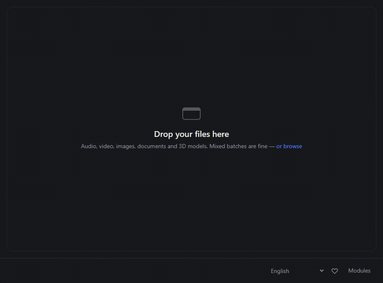
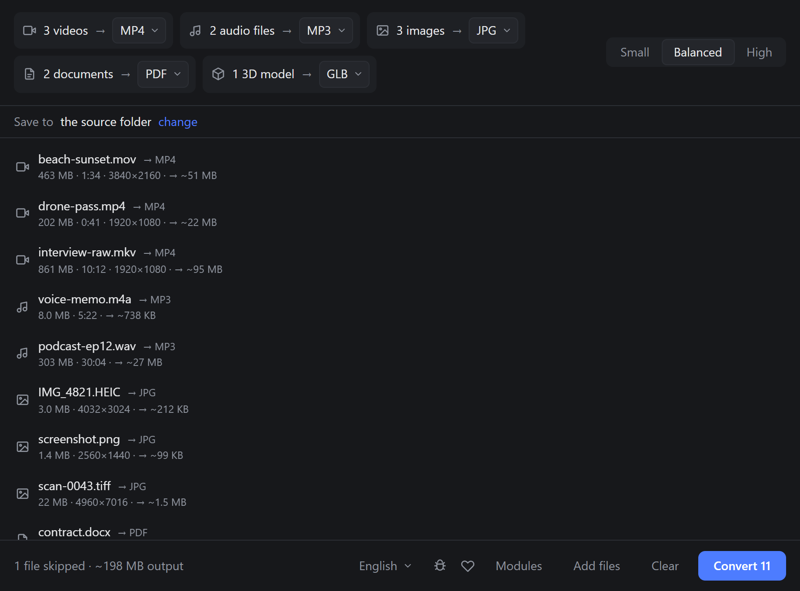
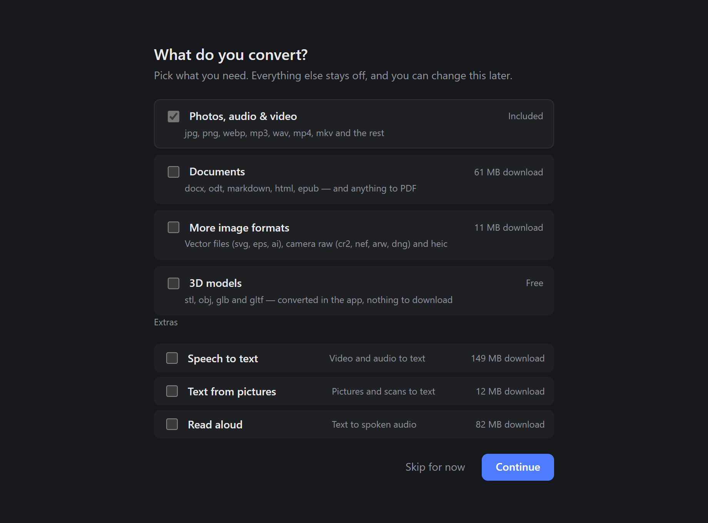
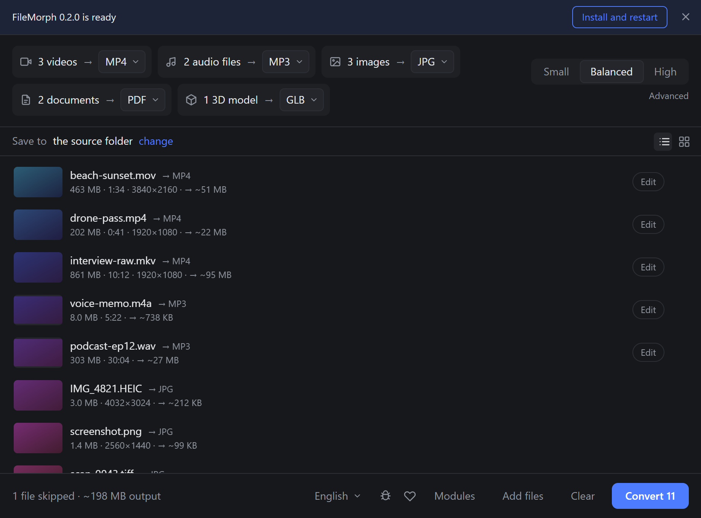
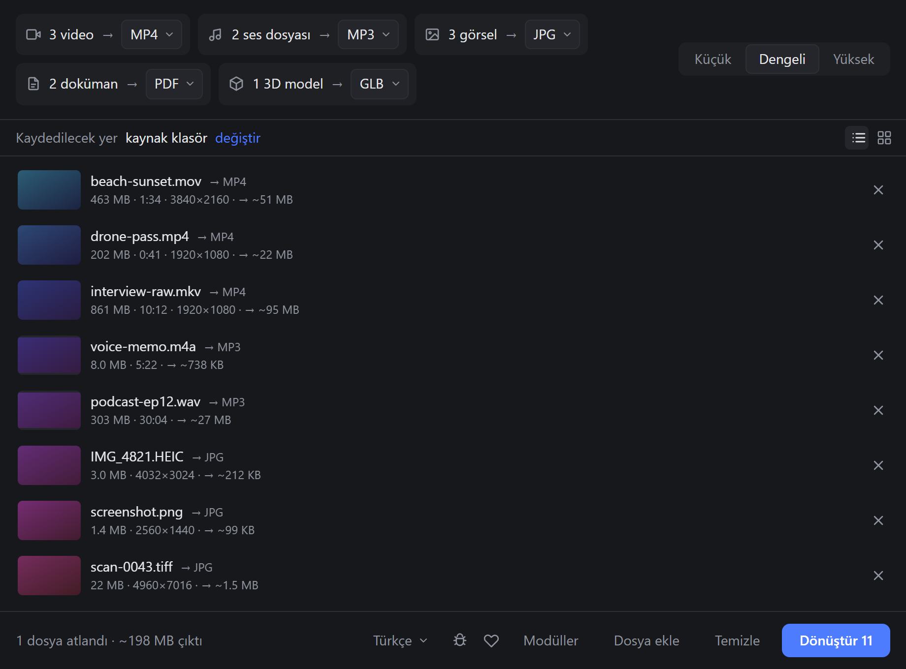
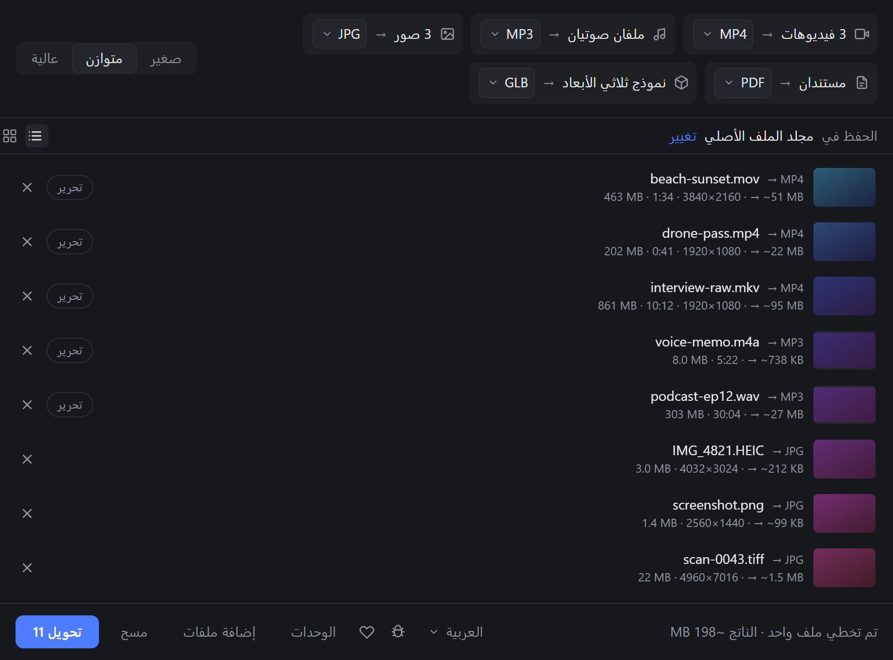

<div align="center">

# Coldmill

**Offline batch file converter.** Drag files in, pick a format per group, hit convert.
No upload, no account, no settings screen.

[](LICENSE)
[](#development)
[](#languages)
[](#how-this-was-built)
[](https://github.com/sponsors/batushn)



</div>

Built with [Tauri v2](https://v2.tauri.app), React and a bundled [ffmpeg](https://ffmpeg.org) sidecar. Everything runs locally — files never leave the machine.

|  |  |
| --- | --- |
|  |  |
| Mixed batch, grouped by type, one format each | First run asks what you actually convert |

## Why

Convertio and friends are simple but upload your files to a server. HandBrake runs locally but greets you with fifty encoder knobs. Coldmill is the middle: local processing, three quality buttons, nothing else.

## Features

- Drop mixed files — they are grouped automatically by type
- One target format per group, only formats that make sense for that type
- Three quality presets: **Small / Balanced / High**. No CRF, no bitrate, no codec pickers
- **Estimated output size** per file and for the batch, refined live while encoding
- Parallel conversion, capped at your CPU core count
- Live per-file progress, cancel any job mid-flight
- Output next to the source file by default
- **16 languages**, picked up from your system on first run

## Updates

Coldmill checks for a new release once at startup. If there is one, a single
line appears at the top — nothing downloads, and nothing restarts, until you
press the button. Dismissing it is one click and it stays quiet until the next
launch.



Updates are signed: the app verifies the signature before it installs anything,
so a tampered file is rejected rather than run. Windows (`.exe`) and the Linux
`.AppImage` update in place; the `.deb` does not, because your package manager
owns that install.

## Languages

English · 中文 · Español · हिन्दी · العربية · Português · Русский · 日本語 · Deutsch · Français · 한국어 · Italiano · Türkçe · Tiếng Việt · Bahasa Indonesia · Polski

The language follows your OS on first launch and can be changed from the footer. Arabic switches the whole interface to right-to-left.

|  |  |
| --- | --- |
|  |  |

## Modules

The first launch asks what you actually convert. Media works out of the box; the other two fetch their engines only if you ask for them, and removing a module deletes them again.

| Module | Download | Converts |
| ------ | -------- | -------- |
| **Media** — always on | bundled | **Video** mp4, mkv, webm, mov, avi, gif · **Audio** mp3, wav, flac, aac, ogg, m4a, opus · **Image** jpg, png, webp, avif, tiff, bmp, gif |
| **Documents** | ~60 MB ([pandoc](https://pandoc.org) + [Typst](https://typst.app)) | docx, odt, md, html, epub, rtf, tex, rst, txt — and anything to PDF |
| **3D** | free | stl, obj, glb, gltf → stl, obj, glb |
| **3D + Blender** | ~400 MB ([Blender](https://blender.org)) | adds fbx, dae, ply and **.blend** |

Two things worth knowing:

- **PDF as an *input*** (and legacy `.doc` / `.xls` / `.ppt`) needs **LibreOffice**, which Coldmill looks for rather than installs — it is a system package and its download URL moves every release. The setup screen says whether it was found and links to the official download. Everything else in the document module works without it.
- The built-in 3D converter carries **geometry only** — no materials, no animation. Blender is the tier that keeps them.

Every engine download is pinned to a version and verified against a published SHA-256 before it is unpacked.

Input format is detected from **magic bytes**, not the file extension — a `.txt` that is really a PNG converts fine, and a renamed archive is rejected up front. Text formats that genuinely have no signature (obj, md, html) fall back to the extension, but only if the bytes really do look like text.

## Development

Requires [Node 18+](https://nodejs.org), [Rust](https://rustup.rs), and the [Tauri system dependencies](https://v2.tauri.app/start/prerequisites/) for your platform.

```bash
npm install
./scripts/fetch-ffmpeg.sh   # downloads the ffmpeg/ffprobe sidecars (~80 MB)
npm run app:dev
```

Build a release bundle:

```bash
npm run app:build
```

Regenerate the app icons after changing the logo:

```bash
npm run icons
```

### Screenshots

The images above are captured from the real UI: `preview/` boots the actual
components in a plain browser with the Tauri bridge swapped for a scripted
mock, and headless Chrome drives it.

```bash
npm run preview   # http://localhost:1421/?scene=queue&lang=tr
npm run capture   # rewrites docs/screenshots/, GIF included
```

### Releasing

Bump the version in `package.json`, `src-tauri/tauri.conf.json` and
`src-tauri/Cargo.toml`, then tag and push; the workflow builds both platforms
and drafts a release:

```bash
git tag v0.2.0 && git push origin v0.2.0
```

The build signs the installers with `TAURI_SIGNING_PRIVATE_KEY`, a repository
secret holding a minisign key. Its public half lives in `tauri.conf.json` and
is what installed copies check against, so **losing the private key means
existing installs can never be updated again** — back it up somewhere real.

### Translations

New strings go into `src/i18n/locales/en.json` first. `npm run check:locales`
fails if any of the other fifteen files drifts, and it runs in CI.

Plurals use `Intl.PluralRules`, so a locale only supplies the forms its
language actually has — `_one` / `_other` for English, `_few` and `_many` for
Russian and Polish, `_two` for Arabic.

### Tests

```bash
cd src-tauri && cargo test
```

There is also a slower check that runs **every** quality preset through the real
ffmpeg sidecar — worth running whenever you touch `presets.rs`:

```bash
cd src-tauri && cargo test -- --ignored --nocapture
```

### Project layout

```
src/                  React UI (single screen + setup)
src-tauri/src/
  detect.rs           magic-byte type detection, with a text tier for obj/md/html
  job.rs              picks the backend for a job and reports every outcome alike
  presets.rs          quality preset -> ffmpeg arguments (the only place to tune encoding)
  estimate.rs         output size model, refined mid-run from real byte counts
  probe.rs            ffprobe metadata / duration
  ffmpeg.rs           sidecar spawn + progress parsing
  external.rs         runs pandoc / LibreOffice / Blender
  document.rs         which document engine handles which pair
  mesh.rs             built-in stl/obj/glb converter, and the Blender script
  engines.rs          pinned, checksum-verified engine downloads
  settings.rs         which modules are on, remembered between runs
  queue.rs            tokio Semaphore worker pool + cancellation registry
  commands.rs         Tauri commands exposed to the frontend
scripts/fetch-ffmpeg.sh
```

Want different encoding settings? Everything lives in [`src-tauri/src/presets.rs`](src-tauri/src/presets.rs). Adding a new engine is a row in [`engines.rs`](src-tauri/src/engines.rs) plus a backend that knows its arguments.

## Not in scope

Deliberately left out to keep the app a single uncluttered screen: codec
selection, GPU encoding, metadata editing, trimming and cropping, watch folders,
a settings screen, and localisation.

On the roadmap: macOS builds, dropping whole folders, and OCR for scanned PDFs.

## How this was built

**Coldmill is vibe coded.** The whole thing — the Rust backend, the React UI,
the ffmpeg preset tables, the engine downloader, all sixteen translations, the
CI workflows, the screenshot harness, and this README — was written by
[Claude](https://claude.com/claude-code) from conversational prompts, with a
human steering the product decisions rather than the keystrokes.

That is not a disclaimer of quality, but it is a fact you should weigh:

- What is **verified**: the Rust test suite, `clippy -D warnings`, every quality
  preset actually run through the bundled ffmpeg, the mesh round-trips checked
  against a real glTF parser, the pinned engine downloads checked against their
  published checksums, and a release bundle that builds on Windows.
- What is **not**: long-run behaviour on large real-world batches, the Blender
  and LibreOffice paths under every version, and the translations, which are
  machine-written and unreviewed by native speakers.

Corrections are welcome — especially to the translations, which are the part
most likely to read slightly off. Open an issue or a PR.

## Support

If Coldmill saved you a trip to a sketchy upload-your-file website, you can
[sponsor the project ♥](https://github.com/sponsors/batushn). It is entirely
optional; the app has no paid tier and never will.

## License

Coldmill is licensed under the [GNU GPL v3.0 or later](LICENSE).

It bundles GPL-licensed ffmpeg builds (which include x264/x265) as a separate sidecar process. ffmpeg is a separate project with its own license — see [ffmpeg.org/legal.html](https://ffmpeg.org/legal.html). Binaries are downloaded at build time from [BtbN/FFmpeg-Builds](https://github.com/BtbN/FFmpeg-Builds) and are not distributed in this repository.
